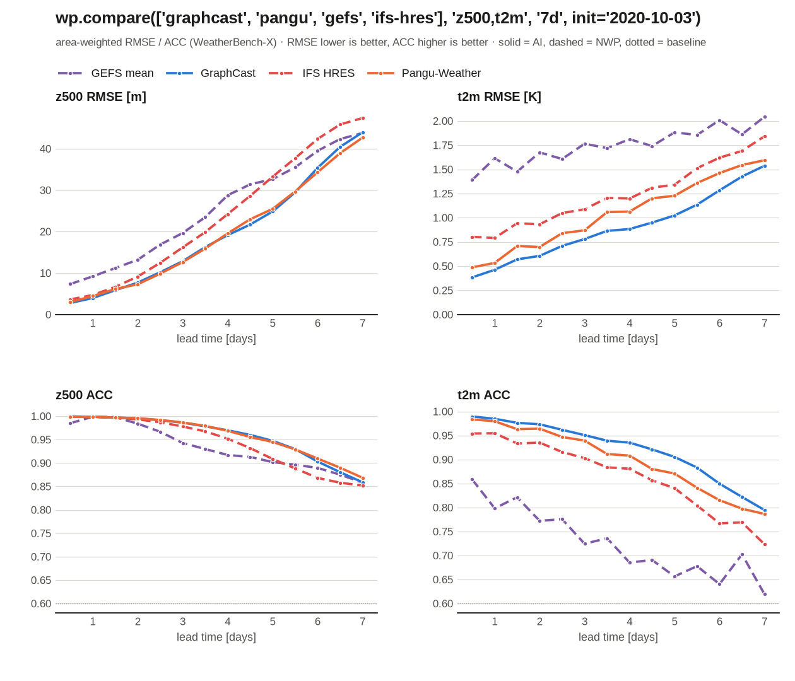
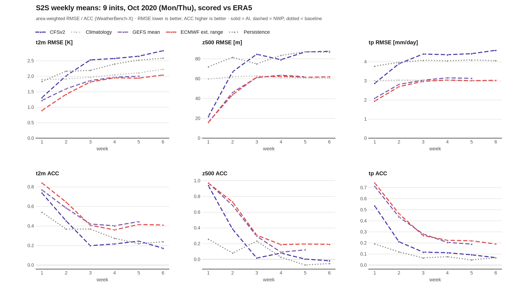
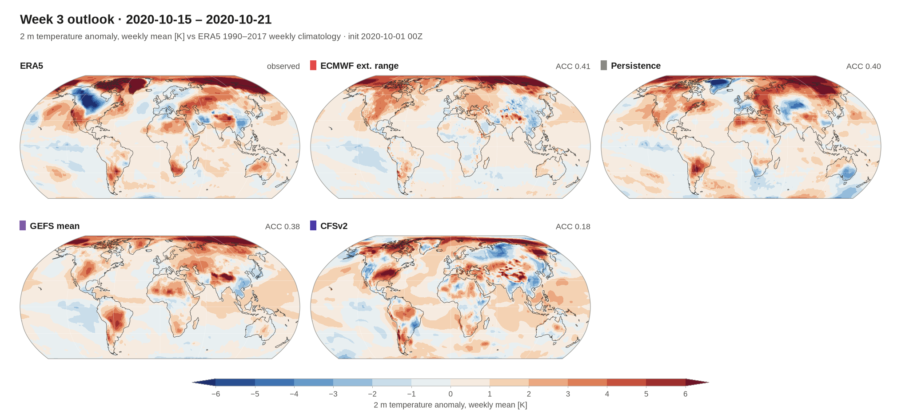
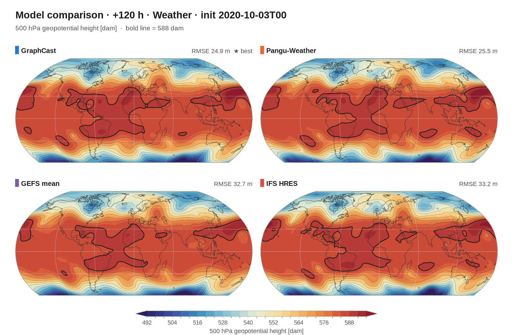

<div align="center">

# 🌦️ WeatherPre

**One line to forecast. One line to compare.**<br>
Weather (≤ 15 days) and sub-seasonal-to-seasonal (> 15 days) forecasts from 28 AI and NWP models (+ 2 baselines) (GraphCast, AIFS, Aurora, FourCastNet 3, GEFS, ECMWF extended range, CFSv2 …), scored against ERA5 with WeatherBench-X.

[](https://github.com/GISWLH/WeatherPre/actions/workflows/ci.yml)

[](LICENSE)

[](https://colab.research.google.com/github/GISWLH/WeatherPre/blob/main/notebooks/colab_earth2studio.ipynb)

[English](README.md) · [中文](README_zh.md) · [Examples](docs/EXAMPLES.md) · [Survey](docs/SURVEY.md) · [GPU routes](docs/GPU.md) · [Contributing](CONTRIBUTING.md)



</div>

```python
import weatherpre as wp

ds  = wp.forecast("graphcast", "z500", "7d", init="2020-10-03")            # model, variable, horizon -> xarray
cmp = wp.compare(["graphcast", "pangu", "gefs", "ifs"], "z500,t2m", "7d", init="2020-10-03")
cmp.ranking()                                                               # who wins, scored vs ERA5
```

## ✨ Why WeatherPre

* **Model × variable × horizon → result.** No GRIB plumbing, no regridding, no per-model APIs: one `xarray.Dataset` with the same names and units for every model.
* **Two forecast scales, one interface.** `"48h"`, `"7d"`, `"15d"` → *weather* (fields at lead hours); `"6w"`, `"45d"`, `"week3-4"` → *S2S* (weekly means and anomalies).
* **Accuracy built in.** `wp.compare(...)` scores every model on the same grid with [WeatherBench-X](https://github.com/google-research/weatherbenchX) (area-weighted RMSE and ACC; ERA5 for the past, IFS analysis for recent cycles), averages over many inits, ranks the models and draws the figures.
* **No GPU needed for 13 models + 2 baselines.** Hosted forecasts are streamed from WeatherBench 2, ECMWF Open Data and NOAA's open buckets. GPU models (AIFS v2, Aurora 1.5, FourCastNet 3, Atlas, U-CAST, WeatherNext 2, FuXi-S2S …) run through [NVIDIA Earth2Studio](https://github.com/NVIDIA/earth2studio) or a Hugging Face ZeroGPU Space with **the same call**.
* **Nothing re-implemented.** Every route wraps an upstream product or package, so you get the official numbers.
* **Publication-ready figures.** Robinson maps, skill curves and S2S anomaly panels in one call.

## 🚀 Install

```bash
pip install "weatherpre @ git+https://github.com/GISWLH/WeatherPre"      # Python >= 3.11
pip install "weatherpre[gpu] @ git+https://github.com/GISWLH/WeatherPre" "earth2studio[fcn3]"   # optional: GPU models
```

## ⚡ Quick start

```python
import weatherpre as wp

# weather scale (<= 15 days): fields at lead hours
ds = wp.forecast("aifs", "t2m", "15d")                                   # latest ECMWF AIFS cycle, 0.25°
ds = wp.forecast("gefs", ["z500", "tp"], "48h", init="2020-10-03")       # NOAA GEFS ensemble mean
ds = wp.forecast("aurora", "msl", "7d", init="2020-10-03")               # GPU: HF ZeroGPU (HF_TOKEN) or Earth2Studio
ds = wp.forecast("e2s:FCN3", "t2m", "7d", init="2020-10-03")             # any Earth2Studio model by class name

# S2S scale (> 15 days): weekly means, week k = days 7(k-1)..7k after init
s = wp.forecast("ifs-ext", "t2m", "6w", init="2020-10-01")               # ECMWF extended range, weeks 1-6
s = wp.forecast("cfsv2", "tp", "week3-4")                                # latest CFSv2, weeks 3-4
wp.anomaly(s)                                                            # vs ERA5 1990-2017 weekly climatology

# accuracy comparison
cmp = wp.compare("auto", "z500", "15d", init="2020-10-03")               # best hosted models for that date
cmp = wp.compare(["ifs-ext", "gefs", "cfsv2", "persistence", "climatology"], "t2m", "6w",
                 init="2020-10-01..2020-10-29")                          # every Mon/Thu init, scores averaged
cmp.table("acc"); cmp.ranking(); cmp.plot("scores.png"); cmp.plot_maps("week3.png", "t2m", 3)
```

Same thing from the shell:

```bash
weatherpre models --scale s2s                                 # what can I run? (--all adds GPU models)
weatherpre forecast graphcast z500 7d --init 2020-10-03 --plot
weatherpre compare ifs-ext,gefs,cfsv2,climatology t2m 6w --init 2020-10-01   # table + ranking + figures
```

| `lead=` | scale | what you get |
|---|---|---|
| `"48h"` · `"7d"` · `"15d"` | weather | `dims (lead, latitude, longitude)`; leads every 6 h to 48 h, 12 h to 7 d, 24 h to 15 d |
| `24` · `[6, 12, 24]` · `"24,48,72"` | weather | exactly these lead hours |
| `"6w"` · `"45d"` · `"2m"` · `"s2s"` | S2S | `dims (week, latitude, longitude)`, weeks 1..N, weekly means (`tp` in mm/day) |
| `"week3-4"` · `"w3"` | S2S | only those weeks |

Variables: `z500` [m], `t850` [K], `t2m` [K], `msl` [hPa], `tp` [mm, accumulated since init; mm/day for S2S] (aliases like `"precip"`, `"mslp"`, `"T2M"` work). `init`: date, `"YYYY-MM-DDTHH"`, `"latest"`, a list, or `"START..END"` for `compare`.

## 📊 Accuracy at a glance

<!-- S2S:START -->
**S2S scale: weeks 1–6, every Monday/Thursday init of October 2020 (9 inits), weekly means vs ERA5** — one call:

```python
cmp = wp.compare(["ifs-ext", "gefs", "cfsv2", "persistence", "climatology"], "t2m,z500,tp", "6w", init="2020-10-01..2020-10-29")
```

| t2m ACC (weekly mean anomaly) | wk 1 | wk 2 | wk 3 | wk 4 | wk 5 | wk 6 |
|---|---:|---:|---:|---:|---:|---:|
| ECMWF extended range (ens. mean) | **0.84** | **0.64** | 0.41 | 0.36 | 0.41 | **0.41** |
| NOAA GEFS (ens. mean, to 35 d) | 0.77 | 0.58 | **0.42** | **0.40** | **0.44** | – |
| NOAA CFSv2 (member 1) | 0.74 | 0.45 | 0.20 | 0.22 | 0.24 | 0.17 |
| ERA5 anomaly persistence | 0.54 | 0.37 | 0.37 | 0.27 | 0.22 | 0.24 |

| t2m RMSE [K] | wk 1 | wk 2 | wk 3 | wk 4 | wk 5 | wk 6 |
|---|---:|---:|---:|---:|---:|---:|
| ECMWF extended range | **0.89** | **1.41** | **1.81** | **1.95** | **1.94** | **2.04** |
| NOAA GEFS | 1.21 | 1.59 | 1.86 | 1.97 | 2.00 | – |
| climatology | 1.89 | 1.91 | 1.97 | 2.04 | 2.10 | 2.22 |
| NOAA CFSv2 | 1.31 | 2.01 | 2.52 | 2.57 | 2.65 | 2.82 |
| persistence | 1.83 | 2.16 | 2.19 | 2.39 | 2.52 | 2.58 |

Skill drops fast after week 2: from week 3 on the ensemble means keep a t2m ACC around 0.4 but their RMSE is barely below climatology, and z500 ACC falls to 0.1–0.3. A single, non-bias-corrected CFSv2 member does worse than persistence for t2m. All numbers (z500, tp, per init): [`results/examples/s2s_2020-10_scores.csv`](results/examples/s2s_2020-10_scores.csv).



<!-- S2S:END -->

**Weather scale, 2020-10-03 00Z, next 7 days** (`wp.compare(["graphcast","pangu","gefs","ifs-hres"], "z500,t2m", "7d", init="2020-10-03")`, vs ERA5, 1.5°):

| mean rank | model | z500 RMSE +72 h [m] | z500 RMSE +168 h [m] | t2m RMSE +168 h [K] |
|---:|---|---:|---:|---:|
| 1.3 | GraphCast | 12.9 | 44.0 | **1.54** |
| 1.8 | Pangu-Weather | **12.7** | **42.7** | 1.59 |
| 3.2 | IFS HRES | 16.2 | 47.4 | 1.84 |
| 3.8 | GEFS ens. mean (0.5° → 1.5°) | 19.7 | 43.8 | 2.04 |

More (next 48 h / week / 15 days with 7 models, the latest live cycle, maps): **[docs/EXAMPLES.md](docs/EXAMPLES.md)**.



## 🗂️ Model zoo

✅ hosted = runs anywhere, no GPU (streamed from open archives) · 🟡 GPU = Earth2Studio / HF ZeroGPU, same call · ⛔ = no open route. `weatherpre models --all` prints this table.

<!-- MODELS:START (generated by scripts/gen_model_table.py, do not edit) -->
**Weather scale (≤ 15 days)**

| Model | Type | Status | Route | Grid | Lead | Hosted period | Licence |
|---|---|---|---|---|---|---|---|
| [`ifs-hres`](https://www.ecmwf.int/en/forecasts) ECMWF IFS HRES | NWP | ✅ hosted | opendata, wb2 | 0.25° / 1.5° | ≤15 d | latest ~4 d (Open Data) · 2016–2022 (WB2) | CC-BY-4.0 |
| [`aifs-single`](https://arxiv.org/abs/2406.01465) ECMWF AIFS | AI | ✅ hosted | opendata | 0.25° | ≤15 d | latest ~4 d (Open Data) | CC-BY-4.0 |
| [`aigfs`](https://registry.opendata.aws/noaa-nws-graphcastgfs-pds/) NOAA AIGFS | AI | ✅ hosted | noaa | 0.25° | ≤16 d | 2026-04-16 → now (NOAA S3) | public domain |
| [`gfs`](https://registry.opendata.aws/noaa-gfs-bdp-pds/) NOAA GFS | NWP | ✅ hosted | noaa | 0.25° | ≤16 d | 2022 → now (NOAA S3) | public domain |
| [`gefs`](https://registry.opendata.aws/noaa-gefs/) NOAA GEFS ens. mean | NWP | ✅ hosted | gefs | 0.5° | ≤35 d (00Z) | 2020-09-23 → now (NOAA S3, GEFSv12) | public domain |
| [`graphcast`](https://doi.org/10.1126/science.adi2336) GraphCast | AI | ✅ hosted | wb2, Earth2Studio `GraphCastOperational` | 1.5° (hosted) | ≤10 d | 2019-11 → 2021-01 (WB2) | weights CC-BY-NC-SA-4.0 |
| [`pangu`](https://doi.org/10.1038/s41586-023-06185-3) Pangu-Weather | AI | ✅ hosted | wb2, Earth2Studio `Pangu6` | 1.5° (hosted) | ≤10 d | 2018–2022 (WB2) | weights CC-BY-NC-SA-4.0 |
| [`fuxi`](https://doi.org/10.1038/s41612-023-00512-1) FuXi | AI | ✅ hosted | wb2, Earth2Studio `FuXi` | 1.5° (hosted) | ≤15 d | 2020 (WB2) | see upstream |
| [`gencast`](https://doi.org/10.1038/s41586-024-08252-9) GenCast (ens. mean) | AI | ✅ hosted | wb2 | 1.5° | ≤15 d, 12 h | 2020 (WB2) | weights CC-BY-NC-SA-4.0 |
| [`neuralgcm`](https://doi.org/10.1038/s41586-024-07744-y) NeuralGCM | AI | ✅ hosted | wb2 | 1.5° | ≤15 d, 12 h | 2020 (WB2) | see upstream |
| [`ifs-ens`](https://www.ecmwf.int/en/forecasts) ECMWF IFS ENS mean | NWP | ✅ hosted | wb2 | 1.5° | ≤15 d | 2018–2022 (WB2) | WB2 terms |
| [`cfsv2`](https://registry.opendata.aws/noaa-cfs/) NOAA CFSv2 | NWP | ✅ hosted | cfs | 1° | ≤9 months | 2020 → now (NOAA S3), member 1 | public domain |
| [`aurora`](https://doi.org/10.1038/s41586-025-09005-y) Aurora | AI | 🟡 GPU | hf, Earth2Studio `Aurora` | 0.25° | any (chunked) | any date (ERA5 / IFS ICs) | MIT |
| [`aurora-1.5`](https://github.com/microsoft/aurora) Aurora 1.5 | AI | 🟡 GPU | Earth2Studio `Aurora1p5_6h` | 0.25° | 6 h steps | any date | MIT |
| [`aifs2`](https://arxiv.org/abs/2509.18994) ECMWF AIFS v2 | AI | 🟡 GPU | Earth2Studio `AIFS2` | 0.25° | 6 h steps | latest (IFS ICs) | CC-BY-4.0 |
| [`aifs2-ens`](https://arxiv.org/abs/2506.10868) ECMWF AIFS-ENS v2 | AI | 🟡 GPU | Earth2Studio `AIFS2ENS` | 0.25° | 6 h steps | latest (IFS ICs) | CC-BY-4.0 |
| [`fcn3`](https://arxiv.org/abs/2507.12144) FourCastNet 3 | AI | 🟡 GPU | Earth2Studio `FCN3` | 0.25° | 6 h steps | any date | see model card |
| [`atlas`](https://huggingface.co/nvidia/atlas-era5) NVIDIA Atlas | AI | 🟡 GPU | Earth2Studio `Atlas` | 0.25° | 6 h steps | any date | see model card |
| [`ucast`](https://arxiv.org/abs/2604.09041) U-CAST | AI | 🟡 GPU | Earth2Studio `UCast` | 1.5° | 12 h steps | any date | see model card |
| [`weathernext2`](https://github.com/google-deepmind/weathernext) WeatherNext 2 (Cyclones) | AI | 🟡 GPU | Earth2Studio `WeatherNext2Cyclones` | 0.25° | 6 h steps | any date | see model card |
| [`gencast-mini`](https://github.com/google-deepmind/graphcast) GenCast mini | AI | 🟡 GPU | Earth2Studio `GenCastMini` | 1° | 12 h steps | any date | see model card |
| [`sfno`](https://arxiv.org/abs/2306.03838) SFNO | AI | 🟡 GPU | Earth2Studio `SFNO` | 0.25° | 6 h steps | any date | see model card |
| [`fengwu`](https://arxiv.org/abs/2304.02948) FengWu | AI | 🟡 GPU | Earth2Studio `FengWu` | 0.25° | 6 h steps | any date | unclear (keep private) |
| [`weathernext`](https://developers.google.com/weathernext) Google WeatherNext 2/3 (hosted) | AI | ⛔ | – | 0.25° | ≤15 d | allow-list only | experimental ToS |

**S2S scale (> 15 days, weekly means)**

| Model | Type | Status | Route | Grid | Lead | Hosted period | Licence |
|---|---|---|---|---|---|---|---|
| [`gefs`](https://registry.opendata.aws/noaa-gefs/) NOAA GEFS ens. mean | NWP | ✅ hosted | gefs | 0.5° | ≤35 d (00Z) | 2020-09-23 → now (NOAA S3, GEFSv12) | public domain |
| [`ifs-ext`](https://www.ecmwf.int/en/forecasts/documentation-and-support/extended-range) ECMWF extended range (ens. mean) | NWP | ✅ hosted | wb2-ext | 1.5° | 46 d, weekly means | 2016–2022, Mon/Thu inits (WB2) | WB2 terms |
| [`cfsv2`](https://registry.opendata.aws/noaa-cfs/) NOAA CFSv2 | NWP | ✅ hosted | cfs | 1° | ≤9 months | 2020 → now (NOAA S3), member 1 | public domain |
| [`climatology`](https://weatherbench2.readthedocs.io) ERA5 climatology | baseline | ✅ hosted | baseline | 1.5° | any | any date (1990–2017 clim.) | Copernicus |
| [`persistence`](https://weatherbench2.readthedocs.io) ERA5 anomaly persistence | baseline | ✅ hosted | baseline | 1.5° | any | 1959 – 2023-01 (ERA5 in WB2) | Copernicus |
| [`ucast`](https://arxiv.org/abs/2604.09041) U-CAST | AI | 🟡 GPU | Earth2Studio `UCast` | 1.5° | 12 h steps | any date | see model card |
| [`fuxi-s2s`](https://doi.org/10.1038/s41467-024-50714-1) FuXi-S2S | AI | 🟡 GPU | Earth2Studio `FuXiS2S` | 1.5° | 42 d, daily | any date | CC-BY-NC-ND |
| [`dlesym`](https://arxiv.org/abs/2409.16247) DLESyM (atmos.+ocean) | AI | 🟡 GPU | Earth2Studio `DLESyMLatLon` | ~1° HEALPix | 6 h → seasonal | any date | see model card |
| [`ace2`](https://arxiv.org/abs/2411.11268) ACE2-ERA5 | AI | 🟡 GPU | Earth2Studio `ACE2ERA5` | 1° | 6 h → climate | any date (forcings) | Apache-2.0 |
<!-- MODELS:END -->

## 🧭 How it works

```
wp.forecast(model, variable, lead, init)
   │  catalog.py: scales, routes, periods, licences          leads.py: "7d" -> weather leads | "6w" -> S2S weeks
   ▼
 resolve()  ── hosted first ──►  WeatherBench 2 (GCS zarr) · ECMWF Open Data · NOAA S3 (GFS, AIGFS, GEFS, CFSv2)
            ── then GPU ──────►  Earth2Studio (any px model) · HF ZeroGPU Space (Aurora)
   ▼
 one schema: (lead | week, latitude, longitude), z500 / t850 / t2m / msl / tp
   ▼
 wp.compare(): regrid to the WB2 1.5° grid (or 0.25°) ─► WeatherBench-X RMSE / ACC ─► table · ranking · figures
```

Truth: ERA5 6-hourly (weather, 2018–2021), ERA5 weekly means + 1990–2017 weekly climatology (S2S, to 2023-01), IFS analysis as a proxy for recent weather cycles. Future valid times cannot be scored; for those, `compare` reports the inter-model spread.

## ⚠️ Honest limits

* Hosted archives differ: WeatherBench 2 forecasts are 1.5° and mostly 2018–2022; ECMWF Open Data keeps only ~4 days; GEFSv12 starts 2020-09-23 and reaches 35 days (00Z); CFSv2 (member 1) is not bias-corrected, so its S2S anomalies carry model climate drift (e.g. over high terrain).
* Scores of models with other native grids are computed after box-smoothing to the WB2 1.5° grid; this is fair between models but not identical to WB2's conservative regridding.
* GPU routes are tested end-to-end with Earth2Studio's `Persistence` model on CPU; the large models need a CUDA GPU and their Earth2Studio extra, and several weights are non-commercial.
* Aurora in 2020 uses ERA5 initial conditions inside its training period (a pipeline check, not out-of-sample skill).

## 🛣️ Roadmap

- [ ] Probabilistic scores (CRPS, spread–skill) for ensembles (GEFS members, AIFS-ENS, GenCast, FCN3)
- [ ] Bias-corrected S2S anomalies from reforecasts (ECMWF / CFSv2 hindcasts)
- [ ] Point / city time series (`wp.forecast(..., at=(35.7, 139.7))`) and regional crops
- [ ] Published GPU runs (Earth2Studio) for a shared leaderboard
- [ ] Hosted docs site

Ideas and new models are welcome: [open an issue](https://github.com/GISWLH/WeatherPre/issues/new/choose) or see [CONTRIBUTING.md](CONTRIBUTING.md).

## 📚 Cite & licence

Code: Apache-2.0 ([CITATION.cff](CITATION.cff)). Data and weights keep their own terms: ECMWF Open Data CC-BY-4.0 (credit ECMWF), NOAA public domain, ERA5 / WeatherBench 2 per Copernicus and WB2 terms; non-commercial weights are never committed. Please also cite the models and [WeatherBench 2](https://doi.org/10.1029/2023MS004019) you use.

Built on [WeatherBench 2 / WeatherBench-X](https://github.com/google-research/weatherbenchX), [Earth2Studio](https://github.com/NVIDIA/earth2studio), [ecmwf-opendata](https://github.com/ecmwf/ecmwf-opendata), [microsoft-aurora](https://github.com/microsoft/aurora), NOAA Open Data Dissemination and [cartopy-robinson-lat-clip](https://github.com/GISWLH/cartopy-robinson-lat-clip). Related: [GISWLH/WeatherAI](https://github.com/GISWLH/WeatherAI) (model ports).
