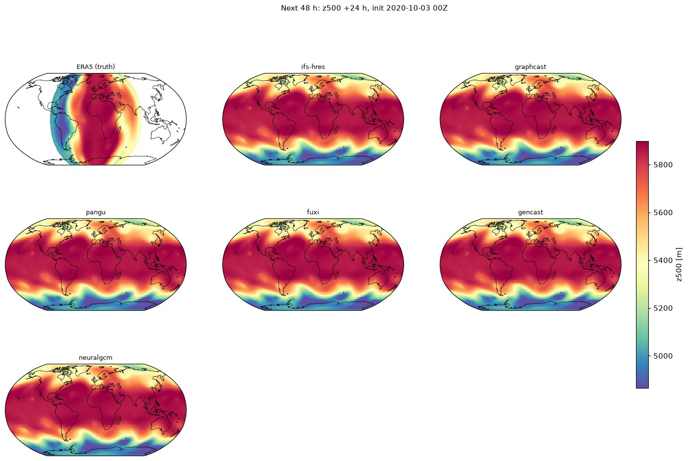
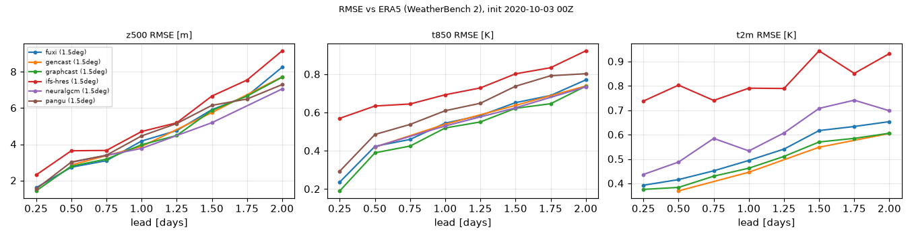
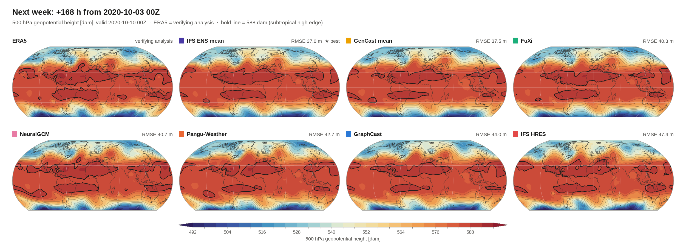
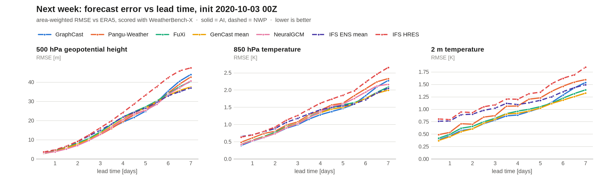
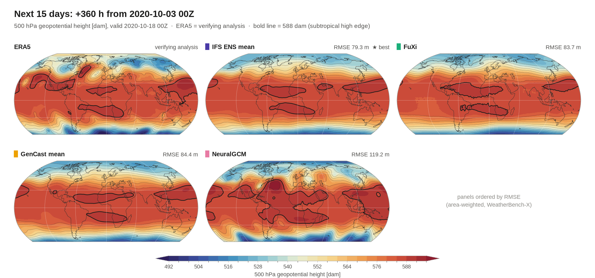
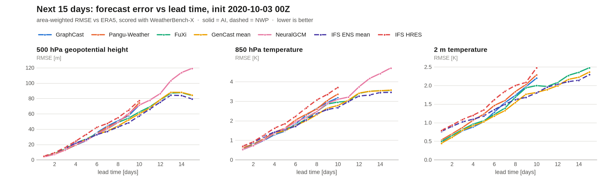
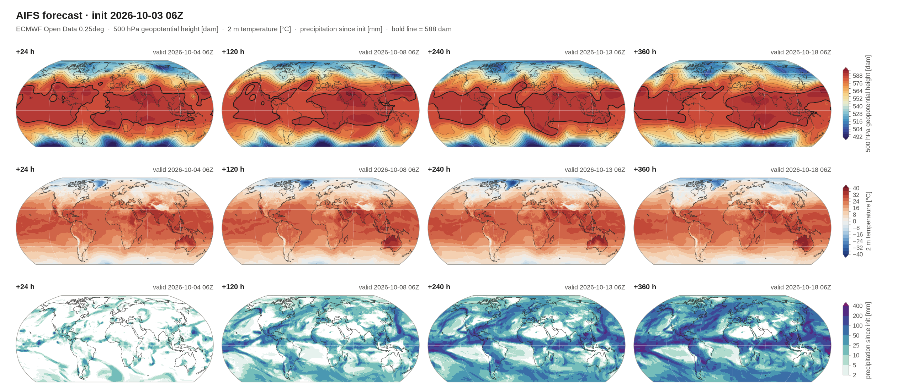
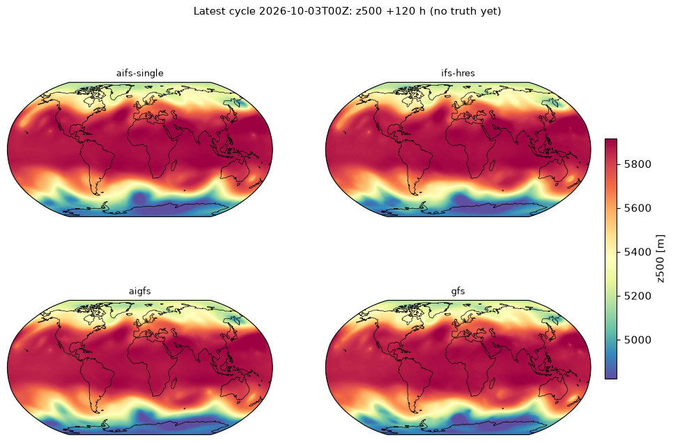

# Now = 2020-10-03: what to expect next / 前向预报示例

> Detailed weather-scale hindcast for **2020-10-03 00Z** (next 48 h / week / 15 days) and the latest live cycle. Regenerate with `python scripts/make_examples.py hours week days15 aifs_latest latest_models`.

"It is 2020-10-03 00Z, give me the next hours / week / 15 days." Best hosted models per horizon are picked by `wp.best_models(init, preset)`. All numbers below are real runs (`scripts/make_examples.py`), scored against ERA5 (WeatherBench 2) with WeatherBench-X (area-weighted RMSE). For a past date this is a **hindcast check**; for a real "now" the valid times are in the future and **cannot be scored**.

### Next 48 h / 未来 6–48 小时 (`preset="hours"`)

Ran: `fuxi` (≤48 h), `gencast` (≤48 h), `graphcast` (≤48 h), `ifs-hres` (≤48 h), `neuralgcm` (≤48 h), `pangu` (≤48 h).

| z500 RMSE [m] | +6 h | +12 h | +24 h | +48 h |
|---|---:|---:|---:|---:|
| fuxi | 1.6 | **2.7** | 4.2 | 8.3 |
| gencast | – | 2.9 | 3.9 | 7.7 |
| graphcast | **1.4** | 2.8 | 4.0 | 7.7 |
| ifs-hres | 2.3 | 3.6 | 4.7 | 9.2 |
| neuralgcm | – | 3.0 | **3.8** | **7.1** |
| pangu | 1.5 | 3.0 | 4.5 | 7.3 |

| t2m RMSE [K] | +6 h | +12 h | +24 h | +48 h |
|---|---:|---:|---:|---:|
| fuxi | 0.4 | 0.4 | 0.5 | 0.7 |
| gencast | – | **0.4** | **0.4** | **0.6** |
| graphcast | **0.4** | 0.4 | 0.5 | 0.6 |
| ifs-hres | 0.7 | 0.8 | 0.8 | 0.9 |
| pangu | 0.4 | 0.5 | 0.5 | 0.7 |

Single-model maps, ECMWF IFS HRES z500 / t2m / msl: [`docs/img/2020-10-03_hours_hres_maps.png`](img/2020-10-03_hours_hres_maps.png). CSV: [`results/examples/2020-10-03_hours_scores.csv`](../results/examples/2020-10-03_hours_scores.csv).

### Next week / 未来一周 (`preset="week"`)

Ran: `fuxi` (≤168 h), `gencast` (≤168 h), `graphcast` (≤168 h), `ifs-ens` (≤168 h), `ifs-hres` (≤168 h), `neuralgcm` (≤168 h), `pangu` (≤168 h).

| z500 RMSE [m] | +24 h | +72 h | +120 h | +168 h |
|---|---:|---:|---:|---:|
| fuxi | 4.2 | 14.1 | 27.1 | 40.3 |
| gencast | 3.9 | 13.4 | 26.6 | 37.5 |
| graphcast | 4.0 | 12.9 | **24.9** | 44.0 |
| ifs-ens | 4.8 | 15.0 | 26.5 | **37.0** |
| ifs-hres | 4.7 | 16.2 | 33.2 | 47.4 |
| neuralgcm | **3.8** | 12.8 | 25.3 | 40.7 |
| pangu | 4.5 | **12.7** | 25.5 | 42.7 |

| t2m RMSE [K] | +24 h | +72 h | +120 h | +168 h |
|---|---:|---:|---:|---:|
| fuxi | 0.5 | 0.8 | 1.1 | 1.4 |
| gencast | **0.4** | 0.8 | **1.0** | **1.3** |
| graphcast | 0.5 | **0.8** | 1.0 | 1.5 |
| ifs-ens | 0.8 | 1.0 | 1.2 | 1.5 |
| ifs-hres | 0.8 | 1.1 | 1.3 | 1.8 |
| pangu | 0.5 | 0.9 | 1.2 | 1.6 |

CSV: [`results/examples/2020-10-03_week_scores.csv`](../results/examples/2020-10-03_week_scores.csv).

### Next 15 days / 未来 15 天 (`preset="15days"`)

Ran: `fuxi` (≤360 h), `gencast` (≤360 h), `ifs-ens` (≤360 h), `neuralgcm` (≤360 h), `graphcast` (≤240 h), `ifs-hres` (≤240 h), `pangu` (≤240 h).

| z500 RMSE [m] | +24 h | +120 h | +240 h | +360 h |
|---|---:|---:|---:|---:|
| fuxi | 4.2 | 27.1 | 62.2 | 83.7 |
| gencast | 3.9 | 26.6 | 59.8 | 84.4 |
| graphcast | 4.0 | **24.9** | 71.1 | – |
| ifs-ens | 4.8 | 26.5 | **57.1** | **79.3** |
| ifs-hres | 4.7 | 33.2 | 77.2 | – |
| neuralgcm | **3.8** | 25.3 | 71.2 | 119.2 |
| pangu | 4.5 | 25.5 | 74.4 | – |

| t2m RMSE [K] | +24 h | +120 h | +240 h | +360 h |
|---|---:|---:|---:|---:|
| fuxi | 0.5 | 1.1 | 2.0 | 2.5 |
| gencast | **0.4** | **1.0** | 1.8 | 2.4 |
| graphcast | 0.5 | 1.0 | 2.2 | – |
| ifs-ens | 0.8 | 1.2 | **1.8** | **2.3** |
| ifs-hres | 0.8 | 1.3 | 2.5 | – |
| pangu | 0.5 | 1.2 | 2.3 | – |

CSV: [`results/examples/2020-10-03_15days_scores.csv`](../results/examples/2020-10-03_15days_scores.csv).

### Latest cycle (live) / 最新一轮

`wp.forecast("aifs", init="latest", lead_days=15)`: AIFS-single, init 2026-10-03 06Z, ECMWF Open Data, 0.25°, 15 leads (+24 … +360 h).

Four-model view (`aifs-single`, `ifs-hres`, `aigfs`, `gfs`, all on the 2026-10-03 00Z cycle, +120 h; [t2m](img/latest_week_t2m_models.png)):

No verification exists yet for these valid times, so only the **inter-model spread** (RMSE of each model against the 4-model mean, a consensus not a skill score) is given: [`results/examples/latest_week_consensus.csv`](../results/examples/latest_week_consensus.csv). Leads whose valid time already has an IFS analysis are scored against it as a proxy truth.

## Limits / 局限

* **15-day coverage differs per model**: GraphCast, Pangu, IFS HRES stop at 240 h in WeatherBench 2; FuXi, IFS-ENS (ensemble mean), GenCast (ensemble mean, 12 h steps) and NeuralGCM (12 h steps) reach 360 h; NeuralGCM has no t2m. Missing leads are skipped with a warning.
* ECMWF Open Data keeps ~4 days: **no archive**. AIFS / IFS for a 2020 date can only come from WB 2 (IFS HRES) or from running the model yourself (Earth2Studio, not run here).
* WB 2 inits are 00/12Z; hosted data is 1.5° (Aurora / Open Data / NOAA: 0.25°). Scores of different grids are compared against the matching ERA5 grid and are not strictly like-for-like.
* Everything is scored against ERA5, including IFS HRES (its own analysis would score it better). `–` = lead not provided (12 h-step models have no +6 h).
* Future valid times cannot be scored; latest-cycle tables show model spread only.
* Aurora 2020 uses ERA5 initial conditions and the ERA5-pretrained checkpoint, inside its training period: a pipeline check, not out-of-sample skill. **The 2020-10-03 15-day Aurora run is not in the examples**: on HF it completed 7 of 8 chunks (to +336 h) and then hit the Pro ZeroGPU quota (resets after ~23 h) before the result could be collected, so no Aurora panel is shown; a re-run needs a fresh quota (`python scripts/run_aurora.py days15`, then `make_examples.py week days15` picks it up). Earlier, Aurora ran for 2020-10-01 (see `results/aurora_2020-10-01`).
* Colab notebooks and the Earth2Studio wrapper are provided but **not executed**.
